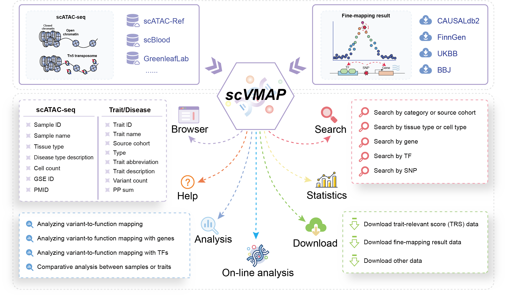

# Welcome to scVMAP Platform Development Front-end!

> scVMAP: https://bio.liclab.net/scvmap/

> scVMAP tutorial: https://scvmap.readthedocs.io/en/latest/

> scVMAP back-end: https://github.com/YuZhengM/scvmap

> scVMAP API: https://bio.liclab.net/scvmap_service/swagger-ui/index.html

A comprehensive platform for human **integrating** `single-cell chromatin accessibility data` with `causal variants`.

## Introduction

> Node.js: v16.13.0

> Vue: 3.2.4

> Axios: 0.21.4

> Bootstrap: v5.1.3

> Element-UI: (element-plus 2.2.0)

> Font Awesome: 6.1.1

> Echarts: 5.3.1

> Plotly: 2.23.0

> CanvasXpress: 38.4.1

## Deploy

[README.md](deploy/README.md)
